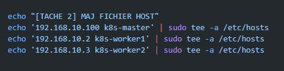

# K8S CLUSTER - ALMALINUX 9

**[Tuto Install](https://www.linuxtechi.com/install-kubernetes-on-rockylinux-almalinux/)**

[](https://www.google.fr)
[](none)

## Overview

Project status: OK

Ce projet vise l'installation d'un cluster complet K8s avec un nombre de worker à definir. (Penser a configurer le Vagrantfile et le Requirements.sh pour le fichier hosts)

---

> **Table of Contents**:
>
> * [Lancement du cluster](#installer-cluster)
> * [Configuration](#configuration)
>   * [Ajout workers](#ajout-workers)
>   * [Changer nom worker](#changement-nom-worker)
> * [Recapitulatif Machines](#recapitulatif-machines)
---

## Installer cluster

```ruby
vagrant up
```

```bash
# vérifier que tout est ok sur master / ou juste faire depuis master 'kubectl get nodes -o wide'
vagrant ssh master -c 'kubectl get nodes -o wide'
```

## Configuration

### Ajout workers

Changer NodeCount dans le Vagrantfile
```ruby
Vagrant.configure(2) do |config|

  # Change to add more workers
  NodeCount = 2
  
  #global requirements
  config.vm.provision "shell", path: "requirements.sh", :args => NodeCount
```

!!!!! Pensez à modifier fichier `requirement.sh` en conséquence !!!!!



### Changement nom worker
```bash
kubectl label nodes worker1 node-role.kubernetes.io/worker=worker
```

## Recapitulatif Machines
| name | ip | memory | core | disk | os | id/pw
|---| --- | --- | --- | --- | --- | ---
|k8s-master| 192.168.10.100  | 2048 | 2 | 33 | [Almalinux 9.2 x64](https://app.vagrantup.com/almalinux/boxes/9) | vagrant/vagrant
|k8s-worker1| 192.168.10.2  | 2048 | 2 | 47 | [Almalinux 9.2 x64](https://app.vagrantup.com/almalinux/boxes/9) | vagrant/vagrant
|k8s-worker2| 192.168.10.3  | 2048 | 2 | 47 | [Almalinux 9.2 x64](https://app.vagrantup.com/almalinux/boxes/9) | vagrant/vagrant
